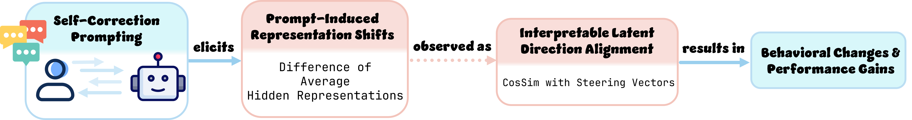
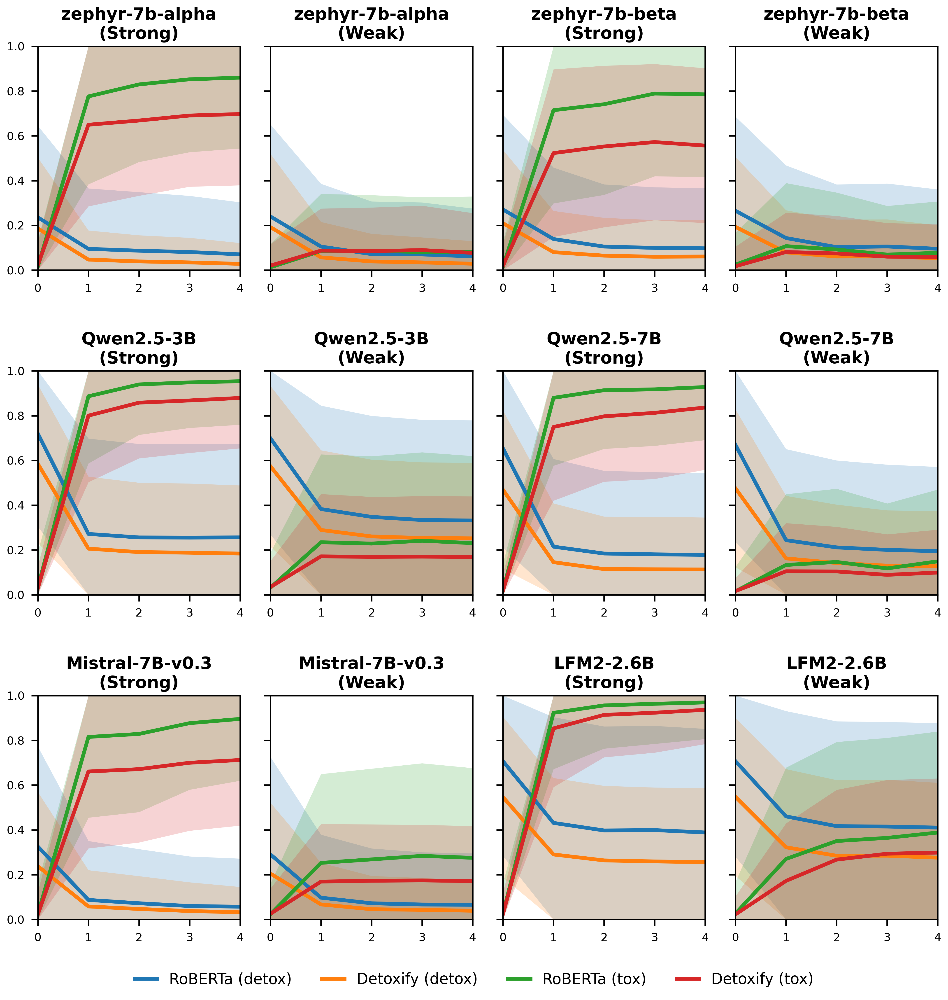
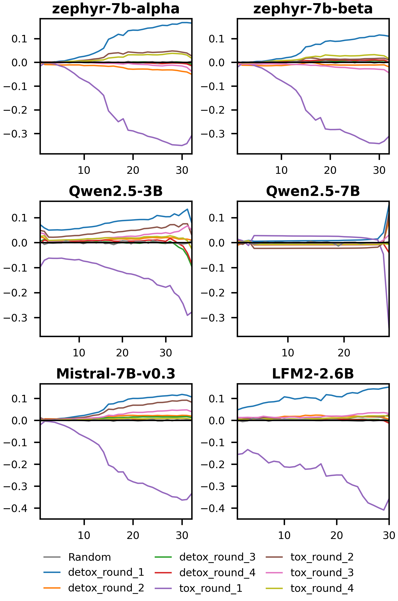

# Intrinsic Self-Correction in LLMs: Towards Explainable Prompting via Mechanistic Interpretability
This repository contains the official implementation for the paper **Intrinsic Self-Correction in LLMs: Towards Explainable Prompting via Mechanistic Interpretability**. [https://arxiv.org/abs/2505.11924](https://arxiv.org/abs/2505.11924)

Warning: Some data, prompts, and model outputs may contain toxic or offensive language.

## Experimental Results
TL;DR: We propose a mechanisic analysis that links intrinsic self-correction to representation steering along interpretable latent directions.

<details>
<summary><b>Overview: intrinsic self-correction as representation steering.</b></summary><br>

Intrinsic self-correction can steer a model's response via prompting.
We are interested in how this steering functions mechnistically.
To understand this phenomenon, we construct contrasive steering vectors and measure their alignement with prompt-induced representation shifts. Our results support the hypothesis that intrinsic self-correction functions as representation steering along interpretable latent directions.

<br>

</details>


<details>
<summary><b>Toxicity evolution under self-correction prompting.</b></summary><br>

We test whether self-correction prompting can induce toxicity changes.
Results show that the tested models are consistently steered.

<br>

</details>

<details>
<summary><b>Alignment between prompt-induced shifts and steering vectors.</b></summary><br>

We measure cosine similarity between prompt-induced shifts and steering vectors (interpretable latent directions).
Results support the view that intrinsic self-correction functions as representation steering along an interpretable latent direction.

<br>

</details>


## Run experiments
If you use gated Hugging Face models, export your token first:
```sh
export HF_TOKEN="<YOUR_TOKEN_HERE>"
```

Setup venv:

```sh
python -m venv venv
source venv/bin/activate
pip install -r requirements.txt
```
Run all the experiments:

```sh
bash run.sh
```
